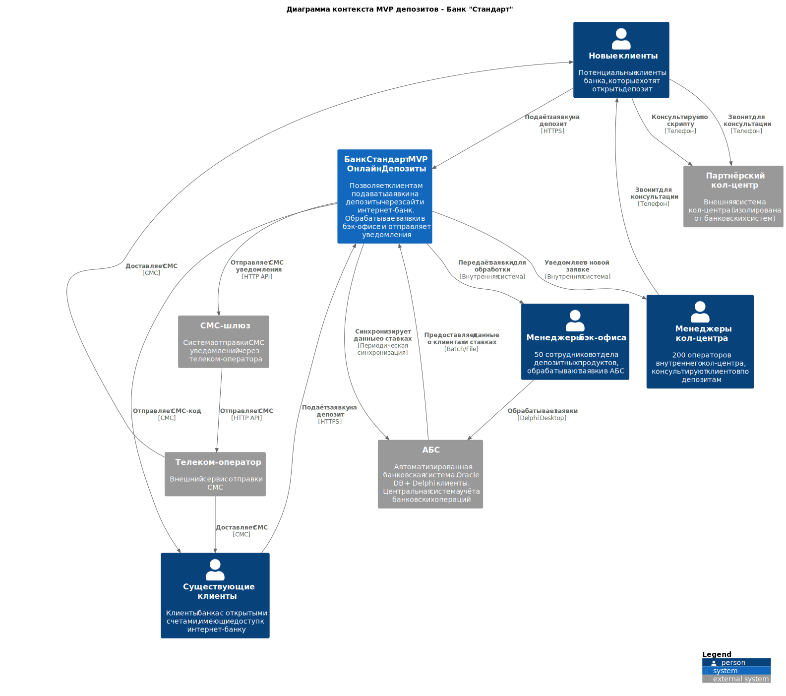
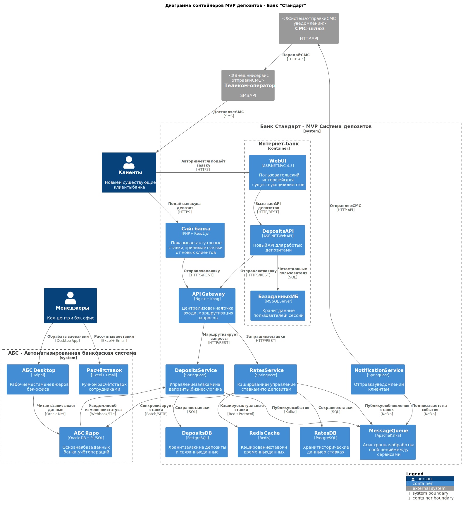

# Task 3: Концептуальная архитектура MVP депозитов

## Цель задания
Подготовить схему концептуальной архитектуры открытия депозитов для MVP в формате ADR с диаграммами C4.

## Артефакты
1. **[deposits-mvp-adr.md](deposits-mvp-adr.md)** - Архитектурное решение в формате ADR
2. **[context-diagram.puml](context-diagram.puml)** - Диаграмма контекста C4 (PlantUML)
   - [context-diagram.svg](context-diagram.svg) - SVG версия для просмотра
3. **[containers-diagram.puml](containers-diagram.puml)** - Диаграмма контейнеров C4 (PlantUML)
   - [containers-diagram.svg](containers-diagram.svg) - SVG версия для просмотра

## Описание решения

### Диаграмма контекста
Показывает участников системы и их взаимодействие с MVP депозитов:

### Диаграмма контейнеров
Детализирует архитектуру системы с микросервисами и интеграциями:

## Ключевые архитектурные решения

### Основные принципы:
1. **Микросервисная архитектура** - новые сервисы изолированы от АБС
2. **Асинхронная обработка** - использование Kafka для снижения нагрузки на АБС
3. **Кэширование ставок** - Redis для быстрого доступа к актуальным данным
4. **API Gateway** - централизованная точка входа и маршрутизации
5. **Совместимость с legacy** - интеграция через файловый обмен с АБС

### Технологический стек:
- **Backend**: Spring Boot (новые сервисы), ASP.NET MVC 4.5 (интернет-банк)
- **Очереди сообщений**: Apache Kafka
- **Кэширование**: Redis
- **Базы данных**: PostgreSQL (новые сервисы), Oracle (АБС), MS SQL (интернет-банк)
- **Контейнеризация**: Docker + Kubernetes