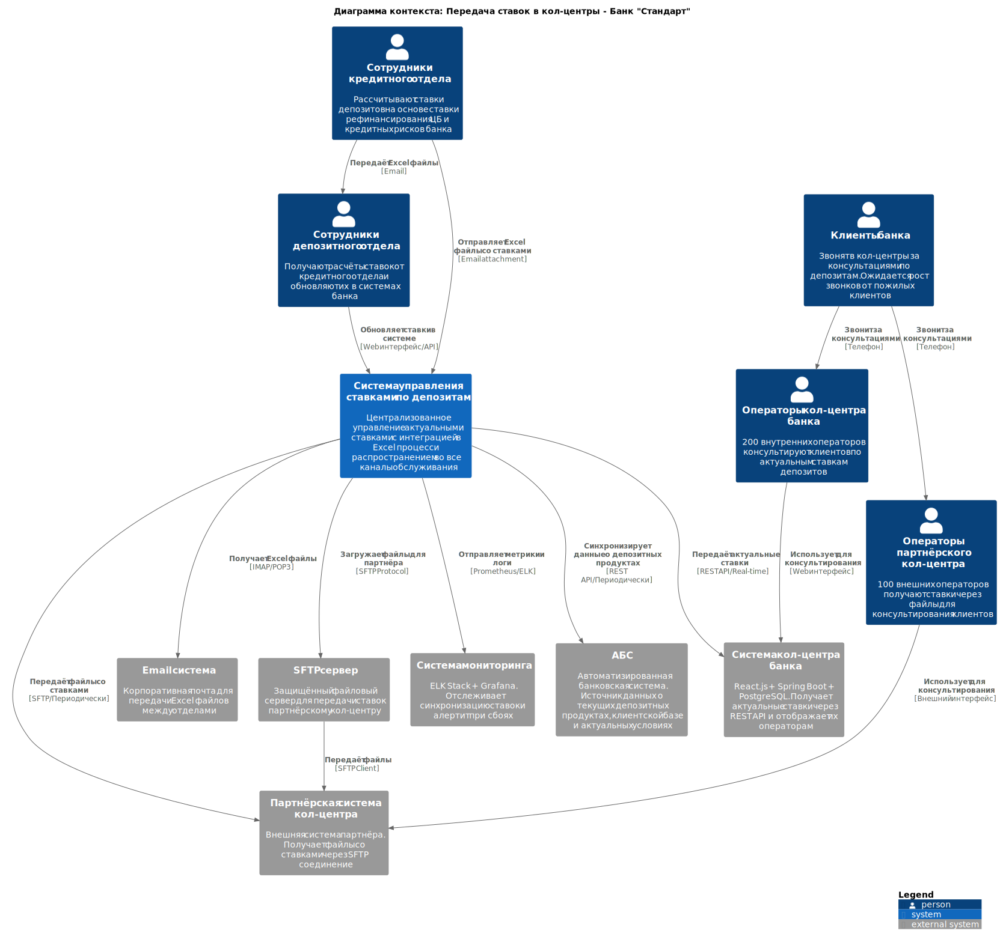
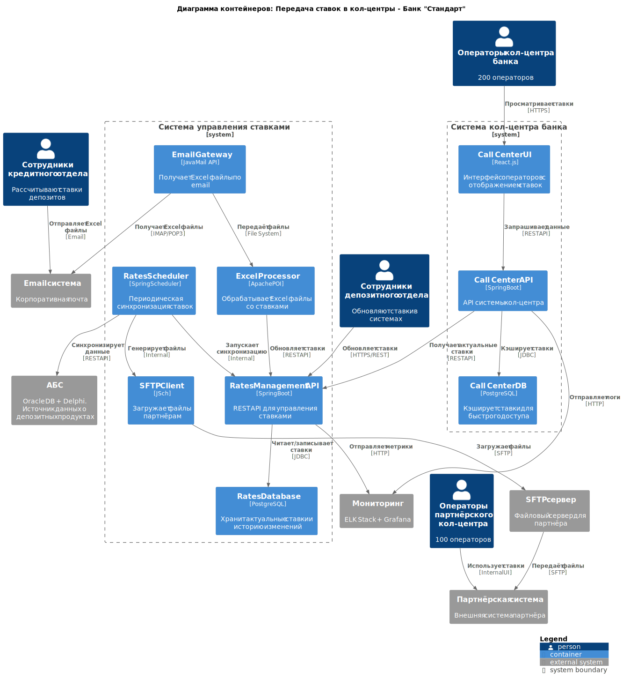

# Task 4: Передача ставок в кол-центр + RoadMap

## Цель задания
Обеспечить консультирование клиентов по депозитным ставкам через кол-центр и создать план реализации MVP.

## Проблема
При запуске маркетинговой кампании ожидается рост звонков в кол-центр от пожилых клиентов с вопросами по депозитам. Операторы должны иметь доступ к актуальным ставкам.

## Требования
1. Внутренний кол-центр (200 операторов) должен видеть актуальные ставки по депозитам
2. Партнёрский кол-центр (100 операторов) должен получать ставки через SFTP файлы
3. Интеграция с текущим процессом расчёта ставок (Excel + email)

## Ограничения
- Партнёрский кол-центр работает во внешней системе
- Нет возможности API-интеграции с партнёром
- Готовы получать данные только в виде файлов (SFTP)

## Артефакты
1. **[call-center-rates-adr.md](call-center-rates-adr.md)** - ADR для передачи ставок в кол-центр
2. **[system-tasks-list.md](system-tasks-list.md)** - Детализированный список задач по системам
3. **[context-diagram.puml](context-diagram.puml)** - Диаграмма контекста C4 (PlantUML)
   - [context-diagram-rates.svg](context-diagram-rates.svg) - SVG версия
4. **[containers-diagram.puml](containers-diagram.puml)** - Диаграмма контейнеров C4 (PlantUML)
   - [containers-diagram-rates.svg](containers-diagram-rates.svg) - SVG версия
5. **[roadmap-6months.drawio](roadmap-6months.drawio)** - RoadMap реализации на 6 месяцев
   - [roadmap-6months.drawio.svg](roadmap-6months.drawio.svg) - SVG версия

## Диаграмма контекста

## Диаграмма контейнеров

## RoadMap реализации (6 месяцев)

## Связь с MVP
Дополняет основное решение MVP депозитов, обеспечивая полный customer journey через все каналы обслуживания.